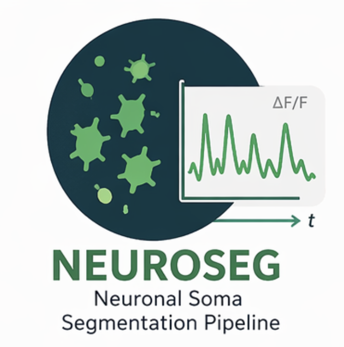

# NEUROSEG



**Neural segmentation pipeline for calcium imaging data.**  
NEUROSEG uses a JEPA-style self-supervised architecture to segment neuronal somas in TIFF stacks, with a full training suite for evaluating three experimental hypotheses (H1, H2, H3).

---

## Table of Contents

- [Reproduce in 20 Minutes](#reproduce-in-20-minutes)
- [Overview](#overview)
- [Requirements](#requirements)
- [Installation](#installation)
- [Project Structure](#project-structure)
- [Usage](#usage)
  - [Inference Mode](#inference-mode)
  - [Training Mode](#training-mode)
  - [Config File Reference](#config-file-reference)
- [Experiments](#experiments)
  - [H1 — Semi-supervised segmentation](#h1--semi-supervised-segmentation)
  - [H2 — Cross-organism transfer](#h2--cross-organism-transfer)
  - [H3 — Temporal representation stability](#h3--temporal-representation-stability)
- [Outputs](#outputs)
- [Experiment Logs](#experiment-logs)
- [Continuous Integration](#continuous-integration)

---

## Reproduce in 20 Minutes

`demo.sh` runs the full H1, H2, and H3 pipelines end-to-end on CPU using a real subset of the Neurofinder benchmark dataset.

### What you need

- Python ≥ 3.10, < 3.14
- [uv](https://docs.astral.sh/uv/) (`pip install uv`)
- `data/neurofinder.00.00/` — mouse visual cortex training set (H1 + H2 target)
- `data/neurofinder.04.00/` — zebrafish training set (H2 source)

Both are available from the [Neurofinder benchmark](https://github.com/codeneuro/neurofinder).

You can also find a subset of the neurofinder dataset on this [Kaggle dataset](https://www.kaggle.com/datasets/mokarbalaee/neurofinder-mini)

### One-command demo

```bash
git clone https://github.com/mo-karbalaee/NEUROSEG.git
cd NEUROSEG
uv sync
bash demo.sh
```

### What happens (6 steps)

| Step | What runs | Output |
| ---- | --------- | ------ |
| 1 | `scripts/prepare_demo_data.py` | `data/demo/` — first 100 frames of `neurofinder.00.00` (mouse); `data/demo_h2_source/` — first 100 frames of `neurofinder.04.00` (zebrafish) |
| 2 | `main.py --mode train --H1 --config config.demo.yaml` | `output/demo_checkpoints/` — JEPA pretrain + finetune + supervised baseline at 3 labeled-data fractions; per-run training curve figures |
| 3 | `main.py --mode train --H2 --config config.demo.yaml` | same checkpoint dir — cross-domain pretrain + target finetune + supervised baseline |
| 4 | `main.py --mode train --H3 --config <temp>` | H3 similarity scores logged to `runs.csv`; `output/demo_checkpoints/figures/h3_similarity.png` |
| 5 | `main.py --mode inference` | `output/demo_inference/` — segmentation masks and activity traces |
| 6 | `scripts/plot_results.py` | `output/figures/` — result figures (Dice + mIoU comparisons, segmentation preview) |

### Result figures

**`output/figures/h1_dice_comparison.png`**  
Grouped bar chart: Dice score vs labeled-data fraction (10 %, 50 %, 100 %) comparing JEPA-pretrained fine-tuning against a supervised baseline. Scores are from the held-out **test set**.

**`output/figures/h1_miou_comparison.png`**  
Same layout as above, showing mIoU instead of Dice.

**`output/figures/h2_dice_comparison.png`**  
Bar chart: Dice score on the target organism comparing JEPA pretrained transfer against a supervised baseline trained from scratch on the target domain. Scores are from the held-out **test set**.

**`output/figures/h2_miou_comparison.png`**  
Same layout as above, showing mIoU instead of Dice.

**`output/figures/segmentation_preview.png`**  
Side-by-side comparison of a raw calcium imaging frame and the predicted neuron segmentation overlay from the inference run.

**`output/demo_checkpoints/figures/h3_similarity.png`**  
Grouped bar chart of within-neuron vs between-neuron cosine similarity across three encoder modes (pretrained, supervised-baseline, random-init), plus a separation gap bar chart.

**`output/demo_checkpoints/figures/`**  
Per-run training curves generated automatically during training. Each fine-tune run produces a 2×2 figure (train loss, val Dice, val mIoU, final test-set bar); each pretrain run produces a 1×2 figure (JEPA loss and reconstruction loss).

### Inspect training logs

```bash
cat output/demo_checkpoints/logs/runs.csv
```

Each row is one training epoch or a final checkpoint summary row. Key columns: `run_id`, `hypothesis`, `mode`, `epoch`, `train_loss`, `val_dice`, `val_miou`, `test_dice`, `test_miou`, `checkpoint`. See the [Experiment Logs](#experiment-logs) section for the full column reference.

---

## Overview

NEUROSEG has two top-level modes:

| Mode | Input | Output |
|------|-------|--------|
| **Inference** | Directory of TIFF stacks | Segmentation masks, activity traces, plots |
| **Training** | Directory of TIFF stacks | JEPA model checkpoint, CSV experiment log |

The inference pipeline runs: **load → normalize → segment → extract ΔF/F₀ traces → visualize**.  
The training pipeline runs one of three hypothesis-driven JEPA experiments (H1 / H2 / H3).

---

## Requirements

- Python ≥ 3.10, < 3.14

---

## Installation

### Option A — Clone and run locally (recommended for development)

Uses [uv](https://docs.astral.sh/uv/) for reproducible environments:

```bash
git clone https://github.com/mo-karbalaee/NEUROSEG.git
cd NEUROSEG
uv sync
uv run main.py --help
```

### Option B — pip install from GitHub (HPC / notebooks)

No clone required. Installs the `neuroseg` package and a `neuroseg` CLI command:

```bash
pip install git+https://github.com/mo-karbalaee/NEUROSEG.git
neuroseg --help
```

### Using in a notebook

After either install method, every module is importable directly:

```python
from neuroseg.pipeline import run
from neuroseg.models.mode import Mode
from neuroseg.models.hypothesis import Hypothesis

run(
    data_dir="/path/to/neurofinder",
    output_dir="/path/to/results",
    mode=Mode.TRAIN,
    hypothesis=Hypothesis.H1,
    config={
        "pretrain_epochs": 200,
        "finetune_epochs": 100,
        "labeled_data_dir": "/path/to/neurofinder",
        "img_size": 128,
        "batch_size": 4,
        "seq_len": 5,
    },
)
```

> **PyTorch on HPC / Kaggle:** If your environment requires a specific CUDA version, install PyTorch first before installing neuroseg.

```bash
pip install torch --index-url https://download.pytorch.org/whl/cu118
pip install git+https://github.com/mo-karbalaee/NEUROSEG.git
```

> **GPU memory:** On a 15 GB GPU, use `batch_size: 4` and `seq_len: 5`. Reduce further if you hit OOM. Set `PYTORCH_ALLOC_CONF=expandable_segments:True` to reduce fragmentation.

---

## Project Structure

```text
NEUROSEG/
├── main.py                          # CLI entry point
├── pyproject.toml
├── config.demo.yaml                 # Scaled-down config for the demo run
├── demo.sh                          # End-to-end reproducibility script
├── data/
│   └── neurofinder.00.00/           # Download from the Neurofinder benchmark
├── scripts/
│   ├── prepare_demo_data.py         # Slice a real-data subset for the demo
│   └── plot_results.py              # Generate figures from training + inference output
├── src/neuroseg/
│   ├── pipeline.py                  # LangGraph pipeline definition
│   ├── logger.py                    # CSV experiment logger
│   ├── plots.py                     # Training curve and comparison figure generators
│   ├── metrics.py                   # dice(), miou()
│   ├── checkpoint.py                # checkpoint save / list
│   ├── cli.py                       # interactive checkpoint picker
│   ├── models/
│   │   ├── state.py                 # LangGraph state schema
│   │   ├── mode.py                  # Mode enum (TRAIN / INFERENCE)
│   │   └── hypothesis.py            # Hypothesis enum (H1 / H2 / H3)
│   ├── nodes/                       # Inference pipeline nodes
│   │   ├── loader.py
│   │   ├── pre_processor.py
│   │   ├── segmenter.py
│   │   ├── activity_trace_calculator.py
│   │   └── visualizer.py
│   └── trainers/                    # Training modules
│       ├── jepa.py                  # JEPA model + factory functions
│       ├── dataset.py               # TIFFVideoDataset, LabeledTIFFDataset, NeurofinderDataset
│       ├── h1_trainer.py            # H1 — semi-supervised segmentation
│       ├── h2_trainer.py            # H2 — cross-organism transfer
│       └── h3_trainer.py            # H3 — temporal representation stability
├── tests/
│   └── test_smoke.py                # Smoke tests (model, metrics, checkpoint)
└── archive/
    └── EB_JEPA_NEUROFINDER.py       # Original research prototype (reference only)
```

---

## Usage

All commands are run from the repository root via `uv run`.

### Inference Mode

Segment all TIFF stacks in a data directory and write results to an output directory.

```bash
uv run main.py \
  --mode inference \
  --data  /path/to/tiff/stacks \
  --output /path/to/results
```

On first run you will be prompted to pick a model checkpoint (or skip to use the Cellpose baseline):

```text
Available checkpoints:
  [1] jepa_pretrained_h1  H1  2024-11-01  Dice=0.8821  mIoU=0.7943
  [2] jepa_h1_finetune_f100  H1  2024-11-02  Dice=0.9104  mIoU=0.8317
  [0] Skip — use Cellpose baseline

Select checkpoint [0-2]:
```

### Config File

Any hyperparameter can be set in a YAML file and passed with `--config`. CLI flags always win over the file.

```bash
uv run main.py --mode train --H1 --data /path/to/data --output ./checkpoints --config config.yaml
```

### Config File Reference

All keys are optional — omitted keys use the defaults shown below.

| Key | Default | Description |
| --- | ------- | ----------- |
| **Model architecture** | | |
| `dobs` | `1` | Input channels (1 for single-channel calcium imaging) |
| `henc` | `32` | Encoder hidden channels |
| `hpre` | `32` | Predictor hidden channels |
| `dstc` | `8` | Latent state channels |
| `seg_head_hidden` | `16` | Segmentation head hidden channels |
| `decoder_hidden_dim` | `16` | Pixel-reconstruction decoder hidden channels (pretrain only) |
| `context_length` | `2` | JEPA predictor context window length |
| **Loss / regularization** | | |
| `std_coeff` | `10.0` | VICReg variance loss coefficient |
| `cov_coeff` | `100.0` | VICReg covariance loss coefficient |
| `std_margin` | `1.0` | Hinge margin for the variance loss |
| **Data** | | |
| `img_size` | `128` | Spatial resolution frames are resized to (px) |
| `seq_len` | `10` | Number of frames per training clip |
| `batch_size` | `8` | Training batch size |
| `num_workers` | `2` | DataLoader worker processes (set `0` for notebooks / macOS) |
| `val_split` | `0.1` | Fraction of data held out for validation |
| `test_split` | `0.2` | Fraction of data held out for the final test evaluation |
| **Training schedule** | | |
| `lr` | `0.001` | Base learning rate |
| `steps` | `4` | JEPA unroll steps per batch |
| `seed` | `1` | Global random seed |
| `pretrain_epochs` | `100` | Pretrain epochs (H1 / H2) |
| `finetune_epochs` | `50` | Fine-tune / supervised-baseline epochs |
| `finetune_budget` | *(same as `finetune_epochs`)* | Epoch budget for H2 target fine-tuning |
| **H1-specific** | | |
| `labeled_data_dir` | *(same as `--data`)* | Path to labeled data for fine-tuning |
| `labeled_fractions` | `[0.01, 0.05, 0.1, 1.0]` | List of labeled-data fractions to sweep |
| **H2-specific** | | |
| `source_data_dir` | — | Source-organism data directory (pretrain domain) |
| `target_data_dir` | — | Target-organism data directory (transfer domain) |
| **H3-specific** | | |
| `h3_data_dir` | *(same as `--data`)* | Labeled data directory for H3 similarity analysis |
| `pretrained_ckpt` | — | Path to H1 pretrained JEPA checkpoint |
| `supervised_ckpt` | — | Path to H1 supervised-baseline checkpoint |
| **Inference** | | |
| `seg_threshold` | `0.5` | Probability threshold for binary segmentation mask |
| `f0_percentile` | `10` | Percentile used to estimate baseline fluorescence F₀ |
| `dff_epsilon` | `1e-6` | Epsilon added to F₀ when computing ΔF/F₀ to avoid division by zero |

See [config.demo.yaml](config.demo.yaml) for a complete working example with a small model suitable for CPU runs.

### Training Mode

Training requires exactly one hypothesis flag (`--H1`, `--H2`, or `--H3`).

```bash
uv run main.py \
  --mode  train \
  --data  /path/to/unlabeled/tiff/stacks \
  --output /path/to/checkpoints \
  --H1
```

---

## Experiments

### H1 — Semi-supervised segmentation

**Hypothesis:** Self-supervised JEPA pretraining improves segmentation when labeled data is scarce.

**Protocol:**

1. Pretrain JEPA on unlabeled TIFF stacks.
2. Fine-tune with labeled-data fractions swept across 1 %, 5 %, 10 %, and 100 %.
3. Train a supervised baseline from scratch under identical conditions (same architecture, random init).
4. Compare Dice / mIoU on the held-out test set across fractions.

**Full run:**

```bash
uv run main.py \
  --mode train \
  --data  /path/to/neurofinder.00.00 \
  --output ./checkpoints \
  --H1 \
  --pretrain-epochs 200 \
  --labeled-data /path/to/neurofinder.00.00 \
  --labeled-fractions 0.01 0.05 0.10 1.0 \
  --finetune-epochs 100
```

Neurofinder-format data is auto-detected. Custom data must follow this layout:

```
labeled_data/
  sample_001/
    video.tif   ← multi-frame TIFF stack  (T × H × W)
    mask.tif    ← binary segmentation mask (H × W  or T × H × W)
  sample_002/
    ...
```

---

### H2 — Cross-organism transfer

**Hypothesis:** JEPA representations generalise better across organisms than supervised features.

**Protocol:**

1. Pretrain JEPA on the source-organism calcium imaging (unlabeled).
2. Fine-tune on the target organism with a limited epoch budget.
3. Train a supervised baseline from scratch on the target organism.
4. Compare transfer drop (Dice / mIoU on test set) between the two modes.

The organism label is inferred automatically from Neurofinder directory names (e.g., `neurofinder.04.00` → zebrafish, `neurofinder.00.00` → mouse.visual_cortex).

```bash
uv run main.py \
  --mode train \
  --data  /path/to/source/tiffs \
  --output ./checkpoints \
  --H2 \
  --source-data /path/to/neurofinder.04 \
  --target-data /path/to/neurofinder.00 \
  --pretrain-epochs 100 \
  --finetune-epochs 10
```

---

### H3 — Temporal representation stability

**Hypothesis:** JEPA embeddings are more stable across time for the same neuron than for different neurons.

**Protocol:**

1. Encode frames with three encoder variants: JEPA-pretrained, supervised-baseline, random-init.
2. Pool per-neuron embeddings spatially using integer segmentation masks.
3. Compute within-neuron cosine similarity (same neuron, different frames) and between-neuron cosine similarity (different neurons, same frame).
4. Report the gap: within − between. Larger gap = more temporally stable representations.

> **Prerequisite:** Run H1 first to produce the pretrained and supervised-baseline checkpoints.

```bash
# Step 1 — run H1 to get checkpoints
uv run main.py --mode train --H1 \
  --data /path/to/neurofinder \
  --output ./checkpoints \
  --labeled-data /path/to/neurofinder

# Step 2 — run H3 pointing at those checkpoints
uv run main.py --mode train --H3 \
  --data /path/to/neurofinder \
  --output ./checkpoints \
  --config config.yaml
```

Where `config.yaml` contains:

```yaml
h3_data_dir: /path/to/neurofinder
pretrained_ckpt: ./checkpoints/jepa_pretrained_h1_<run_id>.pt
supervised_ckpt: ./checkpoints/jepa_h1_supervised_f100_<run_id>.pt
```

The `no_pretrain` mode (random encoder) always runs automatically — no checkpoint needed.

---

## Running Tests

```bash
uv run pytest tests/ -v
```

Smoke tests cover model instantiation, forward passes, metrics, checkpoint round-trips, and dataset helpers. No GPU or real data required.

---

## Outputs

### Inference

```text
output/
  cache/                          ← cached segmentation masks (skipped on re-run)
    masks+<file>.npy
    flows+<file>.pkl
  segmentation/
    <file>/
      frame_0.png  ...
  traces/
    traces+<file>.npy
```

### Training

```
checkpoints/
  jepa_pretrained_h1_<run_id>.pt
  jepa_pretrained_h1_<run_id>.json   ← metadata sidecar: date, hypothesis, mode, arch
  jepa_h1_finetune_f10_<run_id>.pt
  jepa_h1_finetune_f10_<run_id>.json ← metadata sidecar: date, mode, dice, miou, arch
  ...
  logs/
    runs.csv                         ← one row per epoch + one checkpoint summary row per run
  figures/
    pretrain_<model>_curves.png      ← JEPA loss and reconstruction loss over epochs
    finetune_<model>_curves.png      ← train loss, val Dice, val mIoU, final test scores
    h3_similarity.png                ← within/between cosine similarity + gap (H3)
```

The JSON sidecar files store enough information to reconstruct any checkpoint without opening the `.pt` file, including the full model architecture (`arch` dict) used at training time.

---

## Experiment Logs

Every training epoch is appended to `<output_dir>/logs/runs.csv`. No external tracking server required.

Each run produces two kinds of rows:

- **Epoch rows** — one per training epoch; `epoch` is filled, `checkpoint` is empty.
- **Checkpoint row** — one row at the end of the run; `epoch` is empty, `checkpoint` is filled with the path, and `test_dice` / `test_miou` hold the final held-out **test set** scores.

| Column | Description |
| --- | --- |
| `timestamp` | ISO-8601 datetime |
| `run_id` | 8-char hex ID shared by all rows of one run |
| `hypothesis` | H1 / H2 / H3 |
| `mode` | pretrain / finetune / supervised_baseline |
| `model_name` | checkpoint filename stem |
| `labeled_fraction` | fraction of labeled data used (finetune only) |
| `epoch` | epoch index (empty on checkpoint row) |
| `train_loss` | JEPA loss for this epoch |
| `train_recon_loss` | reconstruction loss for this epoch (pretrain only) |
| `val_jepa_loss` | validation JEPA loss (pretrain only) |
| `val_recon_loss` | validation reconstruction loss (pretrain only) |
| `val_dice` | validation Dice score per epoch |
| `val_miou` | validation mIoU per epoch |
| `test_dice` | **test-set** Dice score — checkpoint row only |
| `test_miou` | **test-set** mIoU — checkpoint row only |
| `within_sim` | within-neuron cosine similarity (H3 only) |
| `between_sim` | between-neuron cosine similarity (H3 only) |
| `gap` | within − between gap (H3 only) |
| `checkpoint` | path to saved checkpoint (checkpoint row only) |

To load results in Python:

```python
import pandas as pd

df = pd.read_csv("output/demo_checkpoints/logs/runs.csv")

# test-set scores per mode and fraction (checkpoint rows only)
summary = (
    df[df["checkpoint"].ne("") & df["mode"].isin(["finetune", "supervised_baseline"])]
    .groupby(["mode", "labeled_fraction"])[["test_dice", "test_miou"]]
    .last()
)
print(summary)
```

---

## Continuous Integration

Smoke tests run automatically on every push to `main` via GitHub Actions (`.github/workflows/smoke-tests.yml`). The workflow installs dependencies with `uv` and runs the full test suite — no GPU or real data required.


## Experiment Results on HPC

Here is a list of previous experiment runs on Kaggle. 

- [H2: v0.2.2](https://www.kaggle.com/code/mokarbalaee/h2-experiment?scriptVersionId=331196131)
- [H1: v0.2.3](https://www.kaggle.com/code/mokarbalaee/h1-experiment/notebook?scriptVersionId=331214120)