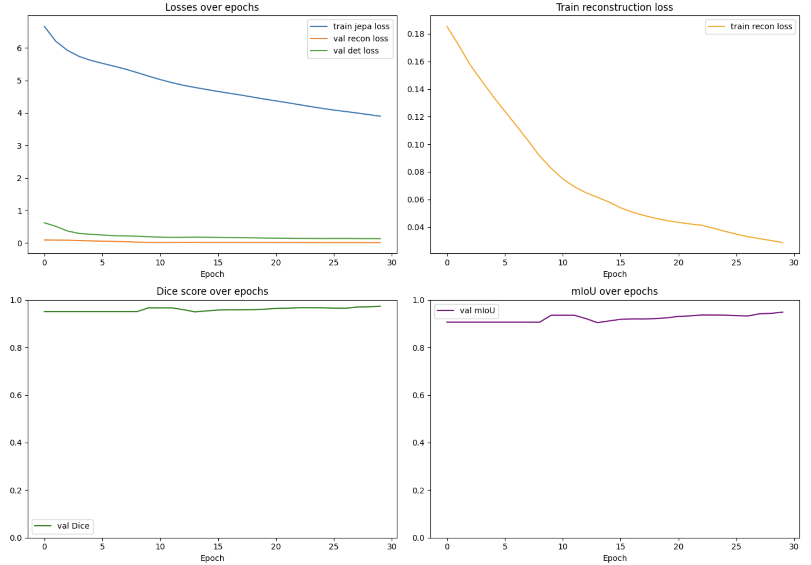

# Experimental Logs of H2

---
## 1st Experiment

| id   | Model   | Method          | Learning Rate | mIoU   | Dice Score | epochs | Batch Size | Dataset     | HPC    | Val Set           | Train Set         |
| ---- | ------- | --------------- | ------------- | ------ | ---------- | ------ | ---------- | ----------- | ------ | ----------------- | ----------------- |
| H2-1 | EB-Jepa | Self-supervised | 1e-3          | 0.9485 | 0.9736     | 30     | 64         | Neurofinder | Kaggle | neurofinder.04.01 | neurofinder.04.00 |
|      |         |                 |               |        |            |        |            |             |        |                   |                   |

---

